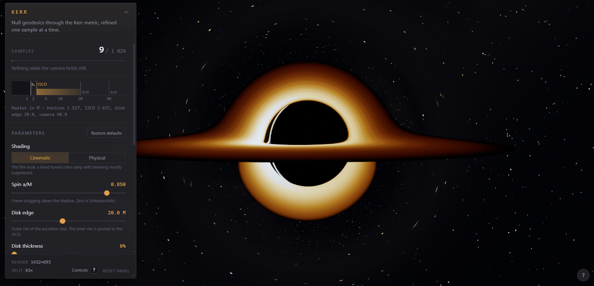

# Kerr

An interactive, physically-based Kerr black hole. Null geodesics are integrated
through the real Kerr metric in a WebGPU compute shader, and the image refines
progressively while the camera holds still.



## Running it

```bash
pnpm install
pnpm dev
```

Needs WebGPU — Chrome or Edge 113+ with hardware acceleration on. If the device
is unavailable the app says so and explains what to check.

Drag to orbit, Shift-drag or right-drag to pan, scroll or pinch to zoom; release
a drag while moving and the view coasts. The keyboard works too — arrows or WASD
orbit, Shift+arrows pan, +/− zoom, R resets. Press **?** (or the **?** button,
or **Controls** in the panel footer) for the full list.

Sliders control spin, disk outer radius, disk thickness, render resolution,
exposure and glow, and a **Shading** switch chooses between the stylized
Cinematic disk and a Physical one (see [Physical shading](#physical-shading)).
The control panel can be dragged, resized and collapsed — see
[The panel](#the-panel).

## Deploying it

`.github/workflows/deploy.yml` builds and publishes to GitHub Pages on every push
to `main` or `master`. Enable it once under **Settings → Pages → Source → GitHub
Actions**. The workflow runs lint, typecheck and the physics suite before it will
publish anything.

`vite.config.ts` reads `GITHUB_REPOSITORY` to set Vite's `base`, so a project
site served from `/<repo>/` gets the right asset paths without the repository
name being written down anywhere. Locally the variable is unset and the base
stays `/`. Pages serves over HTTPS, which WebGPU requires — opening `dist/`
from the filesystem will not work.

## The physics

Geometric units, `G = c = M = 1`. Kerr-Schild coordinates, signature `-+++`:

```
g_uv = eta_uv + f k_u k_v          exact inverse: g^uv = eta^uv - f k^u k^v
```

The metric is static, so `p_t` is exactly conserved. It is fixed at `p_t = -1`
and is **not** integrated — the state is position and spatial momentum only:

```
H(x, p) = 0.5 (-1 + dot(p,p) - f S^2),   S = 1 + dot(k, p)
dx/dl   = p - f S k                       exact closed form
dp/dl   = 0.5 S^2 grad f + f S (p . grad k)   exact closed form
```

The gradient comes from `grad r`, by implicitly differentiating the Kerr-Schild
quartic: `grad r = r / D (x r^2, y r^2, z (r^2 + a^2))` with `D = r^4 + a^2 z^2`.
It used to be a central difference over three axes, which cost 28 metric
evaluations per RK4 step instead of 4 and carried an f32 roundoff floor from
dividing by `2 eps`. The finite-difference form survives in the f64 reference as
an independent oracle, and the two agree to ~1e-9.

RK4 with an adaptive step `dl = clamp(r * 0.045, 0.015, 0.9)`. A ray terminates
when it crosses `r < r_plus * 1.02` (captured, black), passes `r > 60` (escaped,
sample the background), or exhausts its step budget.

Three details worth knowing:

- **Rays are traced in spin −a.** They are launched future-directed *away* from
  the camera, which is the time reverse of the light that actually arrives. Time
  reversal takes Kerr(a) to Kerr(−a) and negates the photon's angular momentum,
  so the geodesics are integrated with `−a` while everything about the disk —
  ISCO, orbital velocity, redshift — uses `+a`. Tracing in `+a`, as this renderer
  once did, draws the hole spinning against its own disk: the flattened edge of
  the shadow lands on the receding side instead of the approaching one.
  `test/physics.test.ts` checks this against the analytic turning point of the
  equatorial radial potential, and against integrating the arriving photon
  backward in time.
- **Only `W = -0.5 f S²` depends on `x`.** The remaining `0.5(-1 + dot(p,p))`
  term has zero `x`-derivative, which is what keeps the gradient small and well
  conditioned in f32.
- **Rays launch with momentum along the view direction**, then the null constraint
  `H = 0` is solved exactly for its magnitude. This is the coordinate-camera
  convention; a static observer's orthonormal tetrad would be more correct, but the
  difference is a smooth FOV-level aberration that is negligible at `r >= 15`, and
  the minimum zoom radius sits well outside the ergosphere.

The **Cinematic** disk is deliberately stylized — a temperature falloff, the
standard Shakura-Sunyaev inner-boundary factor, and a crude Doppler beaming term.
It is not radiative transfer. Color comes from the *observed* temperature,
`T_obs = g · T_emit`, where `g` is the Doppler factor.

### Physical shading

The **Physical** disk replaces every stylized choice with physics and has
nothing to tune but the peak temperature:

- **Flux** is the Novikov-Thorne thin disk (Page & Thorne 1974): zero at the
  ISCO, peaking just outside it — at `r = 9.55` for Schwarzschild — and falling
  as `r⁻³`. The emitted temperature is `T ∝ F^¼`.
- **Redshift** is exact. For a circular Keplerian emitter,
  `g = 1 / (uᵗ (1 − Ω L))` with `Ω = 1/(r^1.5 + a)`, `uᵗ` from Bardeen (1972),
  and `L` the photon's conserved angular momentum, which the tracer already has.
  That one factor carries gravitational redshift, Doppler, transverse Doppler and
  frame dragging. Face-on at `a = 0` it reduces to `sqrt(1 − 3/r)`.
- **Color and brightness** come from the blackbody at `T_obs = g · T`: a thermal
  spectrum stays thermal under a frequency shift, `I_ν,obs = g³ B_ν/g(T) = B_ν(gT)`.
  The shader integrates Planck's law against the CIE 1931 matching functions
  (the Wyman-Sloan-Shirley fit) at 20 wavelengths and converts to linear sRGB.
  The approaching side comes out bluer *and* brighter without anything asking
  it to.

The functions are mirrored in `src/physics/diskReference.ts`, which the renderer
also uses on the CPU for the two normalizations: the flux peak at the current
spin and the luminance at the peak temperature.

## Validating it

Sign errors in a geodesic RHS produce a plausible-looking but wrong picture, so the
physics is checked numerically in two places against two invariants: the null
condition `H = 0`, and the axial angular momentum `L = x·py − y·px`.

```bash
pnpm validate:physics
```

Runs the f64 reference in `src/physics/kerrReference.ts` under Node and asserts
conservation over thousands of RK4 steps, plus the characteristic radii, the
frame-dragging asymmetry (exactly zero at `a = 0`), and an epsilon/step-size sweep
that distinguishes finite-difference truncation from an actual sign error.

The Node suite also checks the analytic gradient against central differences of
`W`, and that the disagreement falls as `O(eps²)` — truncation, not a sign error.

The second check runs the **shipped WGSL** on the GPU and compares it against f64
values computed live in the browser — no stored golden numbers, so it cannot go
stale. Open the app and press **Run** under "Physics check", or load `/?validate=1`.

`src/physics/kerrReference.ts` and `src/gpu/shaders/kerr_math.wgsl` are line-for-line
mirrors of each other. Edit one, edit the other.

## Testing it

```bash
pnpm test
```

A regression suite on Node's built-in runner — no test framework, no browser, no
GPU. It covers what the physics harnesses do not:

- **Shader contracts.** Every mirrored constant in `kerr_math.wgsl` is checked
  against its `kerrReference.ts` counterpart, and the `Uniforms` struct in
  `trace.wgsl` against the one in `present.wgsl` and the slot order
  `packUniforms` writes. That drift is otherwise invisible: it fails at shader
  compilation in a browser, or not at all — a uniform slot swapped with its
  neighbour just renders the wrong picture at full speed.
- **Render scheduling.** `KerrRenderer` is driven against a recording stand-in
  device (`test/support/fakeWebGpu.ts`) with a fake clock, which pins down that
  the bands of a pass tile the image exactly, that the presented texture is
  always the last complete one — including across the start and end of a drag —
  that a moving camera redraws the whole image every frame without reallocating,
  that the interactive resolution adapts to frame time, that the camera eases and
  coasts, and that exposure and bloom do not throw away converged samples while
  spin and step count do.
- **Camera and input.** Basis orthonormality and handedness — a mirrored black
  hole still looks like a black hole — plus drag, pan, pinch, fling, wheel and
  keyboard directions, and listener teardown. The help panel's list is checked
  against the key bindings.
- **Physics beyond the reference.** The analytic gradient against finite
  differences, the time orientation of the traced rays against the analytic
  turning point, and the Physical disk's redshift, flux profile and blackbody
  colors against their known limits.
- **The f64 reference**, as individual assertions rather than one exit code,
  including the step-control helpers and the flat-space limits.

Shader imports use Vite's `?raw`, which plain Node cannot resolve, so
`test/support/wgslRaw.ts` installs a module hook that loads them. It goes in via
`--import` because ESM links the whole graph before running anything.

Two things stay out of reach headlessly, both by nature: the *bodies* of the WGSL
functions, which only the in-app harness above can run, and the React components.

## Layout

```
scripts/validate-physics.mts    Node assertion suite over the f64 reference
test/                           regression suite (pnpm test)
  support/wgslRaw.ts            module hook so Node can load `?raw` shaders
  support/fakeWebGpu.ts         recording stand-in device, for the frame loop
src/physics/kerrReference.ts    f64 reference implementation, shared by both harnesses
src/physics/diskReference.ts    f64 Physical-disk shading: redshift, flux, blackbody
src/gpu/
  KerrRenderer.ts               device, textures, pipelines, frame loop, resize
  camera.ts  uniforms.ts        orbit camera, easing, pan; uniform packing
  validatePhysics.ts            GPU-vs-reference comparison
  shaders/
    kerr_math.wgsl              the physics — prepended to trace and validate
    trace.wgsl                  ray generation, integration, disk, accumulation
    bloom.wgsl                  bright pass, downsample/upsample glare chain
    present.wgsl                composite, tone map onto the swap chain
    validate.wgsl               single-ray invariant tracking
src/ui/
  Controls.tsx                  the panel
  usePanelLayout.ts             drag, resize, collapse, persistence
  orbitControls.ts              pointer, wheel, touch and keys to camera
  HelpPanel.tsx                 the controls reference (?)
  RadialScale.tsx               horizon / ISCO / disk / camera on one axis
```

## The panel

Drag the header to move it, the bottom-right grip to resize, and the chevron (or
a double-click on the header) to collapse it to a title bar that still shows the
sample count. **Controls ?** in the footer, the **?** button in the corner of the
stage, or the ? and H keys open the controls reference; Escape closes it. Position, size and collapsed state persist across reloads, and it
is clamped to stay fully on screen — otherwise the resize grip can end up past
the bottom edge with no way to get it back.

None of that touches the renderer. The panel floats over the canvas rather than
sharing layout with it, so moving or resizing it does not resize the swap chain
and never discards accumulated samples; a panel drag costs no trace frames.
Gestures write geometry straight to the DOM and commit to React state once on
release, for the same reason the orbit camera lives in a ref — a 60 Hz pointer
stream must not reach the render path.

**Restore defaults** puts every control *and* the camera back to their starting
values. **Reset panel** restores the panel's own geometry, which is separate —
you can rearrange the workspace without disturbing the scene, and vice versa.

## How the rendering works

Two passes per frame. A compute pass traces one jittered sample per pixel and
blends it into a running average; a render pass tone maps that onto the canvas,
since compute shaders cannot write the swap chain directly.

Accumulation is **double-buffered** rather than a single read-write texture. That
is not a portability hedge: baseline WebGPU permits `read_write` storage-texture
access only on `r32float`/`r32uint`/`r32sint`.

It is **`rgba32float`**, not `rgba16float`. The blend is `mix(prev, sample, 1/n)`,
and once `n` reaches a few hundred the increment drops below half an f16 ulp and
is rounded away, so the noisiest pixels — the photon ring, the stars — stopped
converging with noise still in them. `rgba32float` is not filterable in core
WebGPU, so the present and bloom passes do their bilinear filtering by hand from
four loads.

Sample jitter uses the R2 low-discrepancy sequence indexed by frame, with a
per-pixel hash applied as a Cranley-Patterson rotation. The blend weight is
`1/n`, so the first pass after a reset fully overwrites and no clear is needed.
Any camera or parameter change resets the count; accumulation stops at 1024
samples and simply re-presents.

**One sample is split across several dispatches**, a horizontal band per frame.
Integrating a whole image in a single submission can occupy a modest GPU for the
better part of a second, and a submission that long stalls compositing and input
handling for the entire tab — the page reads as frozen and slider drags queue up
behind it. The band count auto-tunes to hold each dispatch near a 16 ms budget;
the panel reports it as "Split". Measured main-thread task lateness while
rendering is ~5 ms.

### Moving smoothly

Four rules keep interaction clean, and each fixes an artifact that used to show:

- **The screen only shows complete images.** Any change abandons the pass in
  flight and starts a new one in the other texture, while the last whole image
  stays up. The renderer used to show a pass while it was being written, so new
  bands tore against stale — or, after a reallocation, black — rows.
- **Nothing is reallocated to go coarse.** The accumulation textures are sized
  once for full resolution, and the coarse interactive trace uses a corner of
  them. The presented region travels with the image, so a coarse image stays
  correctly scaled on screen while the full-resolution pass behind it fills in.
  Reallocating on every drag start and stop used to flash black.
- **A moving image is traced whole, every frame,** at a resolution between 20%
  and 60% that adapts to frame time and is remembered across gestures. Splitting
  a moving image into bands meant only the top band was ever refreshed: every
  pointer event restarted the pass at band zero.
- **Input moves a target; the drawn camera eases after it** with a ~70 ms time
  constant, zooming in log-radius. Wheel notches and mouse jitter become
  continuous motion, a released drag coasts and decays, and panning is an
  off-axis lens shift, so it reframes the picture without changing the physics.

Slider drags that change the rays go through the same coarse path, so dragging
spin is live rather than a stutter of restarted full-resolution bands.

### Output

Bloom is a six-level downsample/upsample chain (the Call of Duty scheme: a
Karis-weighted bright pass into half resolution, 13-tap downsamples to 1/64,
tent-filtered upsamples adding each level back into the one above). Deeper
levels are weighted down geometrically, so glare has a core and a soft tail
rather than one Gaussian — and a bright ring beside the shadow does not fill it
with haze. It is composited additively before tone mapping; without it the only
way to make the disk read as luminous is to raise the level until the core clips.

The tone-mapped image is encoded with the exact sRGB curve rather than
`pow(1/2.2)`, which lifts the deep shadows, and gets one step of triangular
dither before 8-bit quantization. The sky is a near-black gradient and banded
visibly without it.

### Stars

Stars are seeded on a 3D lattice around the celestial sphere, so there are no
seams. They used to live on the six faces of a cube, and the neighbor search
never crossed a face edge, so stars were clipped along the seams. Each star is a
point source with a heavy-tailed brightness and a blackbody color, splatted at a
quarter of a traced pixel and normalized to a fixed flux, so it carries the same
light at any resolution instead of sparkling when the trace goes coarse.

The splat stays that small on purpose. From 40 M the Einstein radius is about
18°, so the whole field of view is strongly lensed, and the shear stretches
anything with a width on the sky into a tangential arc — correct for an extended
source, wrong for a star. A faint procedural Milky Way sits under them, and its
lensed image around the shadow is real.

### Lensing level of detail

Right against the shadow there is a razor-thin bright arc, and it used to render
ragged and stair-stepped. Working out why took several wrong guesses, so the
result is worth writing down.

The direct image of the disk maps screen position to disk radius smoothly. Every
*higher-order* image — light that wound around the hole one or more times before
reaching the camera — is compressed exponentially, and by the second or third
pass the entire radial profile is squeezed into a band thinner than one pixel.
Point sampling that is aliasing a signal with no band limit.

What settled it was rendering the disk in a flat color: the same arcs came out
perfectly smooth. So the geometry was never wrong — the raggedness was the
*shading* being sampled below its resolvable scale.

The fix is a level of detail keyed to the image order, which the tracer already
knows because it counts equatorial crossings. Past the first image the radial
detail is faded out: the striation goes to its phase average and the emission
profile settles to the bright inner ring that dominates the stack anyway. It is
the trade a mip level makes for a minified texture — the detail is not
resolvable, so don't pretend to resolve it.

Ruled out by measurement first, in case they look tempting: the integration step
budget (450 → 2000 changed nothing), the striation texture (disabling it entirely
changed nothing), and correlation in the sample sequence (permuting the R2 index
per pixel changed nothing). Giving the disk finite thickness also did not fix it,
though the control survives as a real feature.

One genuine bug did turn up next door. A ray grazing the equatorial plane could
enter and leave it inside a single RK4 step, and since the disk test only sees
one sign change per step, that crossing was dropped entirely. `planeLimitedStep`
now shortens any step that would jump the plane. Its derivative comes from the
RK4 stage-one evaluation, which the loop hoists and feeds back in through
`rk4StepFrom`, so the check costs no extra metric evaluations — it removed one.

## Scripts

| Command | Does |
|---|---|
| `pnpm dev` | Dev server |
| `pnpm build` | Typecheck and build |
| `pnpm lint` | oxlint, type-aware |
| `pnpm typecheck` | `tsc -b` |
| `pnpm test` | Regression suite, `node --test` |
| `pnpm validate:physics` | The Node conservation suite |
